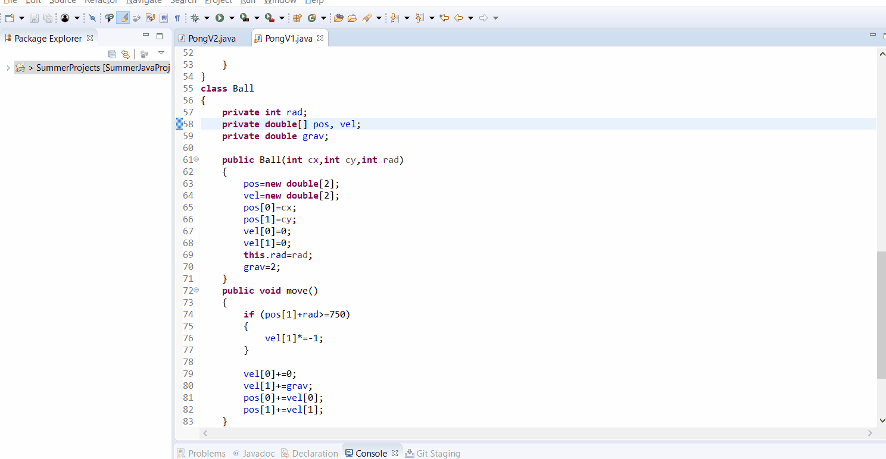
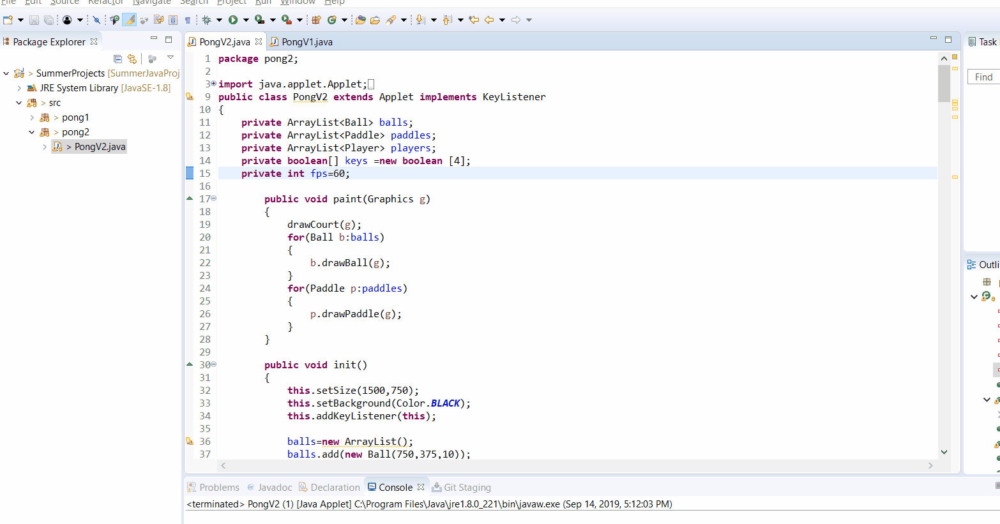

# Pong-in-Java 🏓
Java applets that apply concepts of object oriented programming to visualization of the game of pong

## Demonstration of Pong 1:

* Pong1 was necessary because it served as the framework for what became Pong2.
* In Pong1 I introduced an arraylist to store Ball objects which contain the physics, size, and color of every ball.
* The applet paints each ball, then repaints each ball after applying phsyics and random colors

## Demonstration of Pong 2:

* Created paddle and player classes to handle game functionality.
* Implemented keylisteners to allow for user input
* Refresh rate had to be limited due to poor optimization
